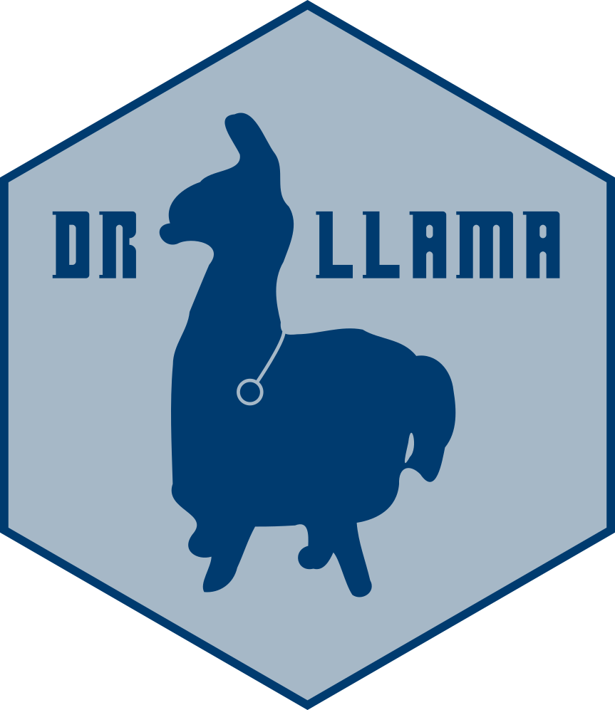

<!-- README.md is generated from README.Rmd. Please edit that file -->

```{r, include = FALSE}
knitr::opts_chunk$set(
  collapse = TRUE,
  comment = "#>",
  fig.path = "man/figures/README-",
  out.width = "100%"
)
```

# Doc-To-R-Llama (drllama) 

<!-- badges: start -->
<!-- badges: end -->

The Documentation-To-R (Doc-To-R) package uses locally run Large Language Models to provide documentation on undocumented R code, improving the readability of code written by others (or by you a long time ago).

## Installation

You can install the development version of DrLlama from [GitHub](https://github.com/) with:

``` r
# install.packages("pak")
pak::pak("zanmat/drllama")
```

drllama requires having [Ollama](https://ollama.com/) installed and running.

