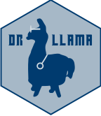

<!-- README.md is generated from README.Rmd. Please edit that file -->

# Doc-To-R-Llama (drllama) 

<!-- badges: start -->

<!-- badges: end -->

The Documentation-To-R (Doc-To-R) package uses locally run Large
Language Models to provide documentation on undocumented R code,
improving the readability of code written by others (or by you a long
time ago).

drllama currently offers two functions:

- code_to_doc: Reads an .R file and spits out a copy with a summary at
  the top and comments throughout the script on functions and pipes
  contained;
- droxygen: Reads a function from an .R file and spits out a roxygen2
  document.

drllama uses the [mall](https://mlverse.github.io/mall/) package.

## Installation

You can install the development version of drllama from
[GitHub](https://github.com/) with:

``` r
# install.packages("pak")
pak::pak("zanmat/drllama")
```

drllama requires having [Ollama](https://ollama.com/) installed and
running.
